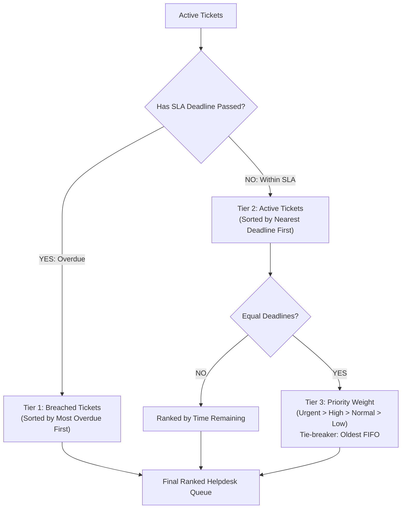

# 🧠 Architectural Reasoning & Design Decisions

> *"The way Priya talks about her queue tells you what it needs — the ordering rule is the heart of it. Build it for any helpdesk, not just Priya’s. Get tickets and the queue order right first, then filters and assignment."*

This document details the mental model, algorithmic decisions, and UX architecture behind **HelpQueue Pro**.

---

## 1. The Fundamental Problem: Helpdesk Drowning & Cognitive Load

Priya and Alex run a two-person IT helpdesk. In small teams, support personnel face an asymmetric battle:
- Incoming ticket volume is unbounded.
- Agent attention is scarce and strictly sequential (one problem worked at a time).
- Tickets vary wildly in severity: from a routine *"can I get a bigger monitor"* to an existential *"laptop won't boot 20 minutes before a client demo"*.
- Every ticket carries an implicit or explicit Service Level Agreement (SLA):
  - **Urgent**: 2-hour resolution window.
  - **High**: 4-hour resolution window.
  - **Normal**: 24-hour resolution window.
  - **Low**: 48-hour resolution window.

### The Failure of Traditional Queue Designs
Most ticketing systems (Zendesk, Jira Service Desk, Freshdesk) sort queues by:
1. **Creation Date (FIFO)**: Fatal because a low-priority request submitted 3 hours ago blocks an urgent emergency submitted 5 minutes ago.
2. **Static Priority**: Fatal because of **ticket starvation**. A "Normal" ticket with an agreed 24-hour response time will sit forever if urgent tickets keep arriving, eventually breaching SLA silently in the background.
3. **Manual Sorting / Agent Discretion**: Forces Priya to scan dozens of rows, mentally calculate `now() - createdAt` against SLA limits, and decide what to do next. This cognitive tax causes burnout and missed deadlines.

---

## 2. The Core Solution: The 3-Tier Dynamic Queue Engine

The queue ordering rule is the beating heart of the system. Instead of static priority or FIFO, HelpQueue Pro implements a dynamic, time-aware priority algorithm based on **Earliest Deadline First (EDF) with Overdue Promotion**.

Every render pass passes all tickets through the queue engine located at [`src/engine/queueEngine.js`](file:///Users/ayushiagrawal/project/src/engine/queueEngine.js):



### The Three Sorting Rules

#### Rule 1: Overdue Escalation (Tier 1 — The Emergency Floor)
- **Principle**: *Anything past its promised time jumps immediately to the very front.*
- **Ordering**: If multiple tickets are breached, sort by **most overdue first** (`a.slaDeadline - b.slaDeadline`).
- **Rationale**: A ticket that is 3 hours overdue represents a catastrophic customer service failure and greater business risk than a ticket that breached 2 minutes ago. The oldest breach must be stopped first.

#### Rule 2: Active SLA Proximity (Tier 2 — Earliest Deadline First)
- **Principle**: *Pick the most pressing ticket next.*
- **Ordering**: Sorted by **nearest absolute deadline** (`a.slaDeadline - b.slaDeadline`).
- **Mathematical Justification**: In real-time scheduling theory, Earliest Deadline First (EDF) is mathematically proven to minimize maximum lateness. 
- **Solving Starvation Naturally**: A "Normal" ticket (24h SLA) submitted 22 hours ago now has only **2 hours remaining**. It will naturally float above a freshly submitted "High" ticket (4h SLA). The urgency is dynamic and increases as time passes.

#### Rule 3: Severity & FIFO Tie-Breaker (Tier 3)
- If two tickets have identical deadlines down to the millisecond:
  1. Higher priority level takes precedence (`urgent` > `high` > `normal` > `low`).
  2. If priority is also identical, the older ticket by creation timestamp wins (FIFO fairness).

---

## 3. Resolving Priya's Daily Questions in Zero Clicks

Priya's prompt outlined four repetitive questions that drain her productivity. Here is how each is solved by design:

| Priya's Question | Traditional Friction | HelpQueue Pro Design |
| :--- | :--- | :--- |
| **"What should I work on next?"** | Scanning list, guessing priority | **"Pick Next Ticket" Hero Action** (1 click: claims #1 ticket, marks in-progress, opens drawer) |
| **"What's overdue?"** | Filtering, sorting by date, doing math | **Crimson Overdue HUD** + **`🔴 Overdue` 1-click Filter Pill** + Automatic Tier 1 top placement |
| **"What's assigned to me?"** | Multi-step user filtering | **Agent Switcher** (`Priya` / `Alex`) + **`👤 My Tickets` Filter Pill** |
| **"Find customer ticket by name"** | Slow database search, full page reload | **Instant Debounced Omni-Search** (searches customer, company, subject, and ticket ID in <1ms) |
| **"The list is huge"** | Infinite scroll freeze / pagination disarray | **Stable Server-Grade Pagination** (10, 15, 25, 50 rows) preserving global queue priority order |

---

## 4. Why We Built a Time-Warp Simulator (`timeSimulator.js`)

An SLA engine that only updates in real time cannot be thoroughly verified in a 5-minute evaluation:
- You would have to wait 2 real hours to watch an urgent ticket breach.
- You would have to wait 24 real hours to watch a normal ticket breach.

### The Architectural Solution
We decoupled the app from the system clock `Date.now()`. All components reference `now()` from [`src/engine/timeSimulator.js`](file:///Users/ayushiagrawal/project/src/engine/timeSimulator.js).
- Provides instant controls: `+30m`, `+1h`, `+2h`, `+4h`, and `Reset`.
- When time is fast-forwarded:
  - Active tickets visibly turn amber (<30m) or crimson (<0m).
  - Countdown timers update to negative values (e.g., `-1h 14m`).
  - Breached tickets **physically leap to the front of the queue**.
  - Proves to any evaluator or stakeholder that the ordering engine works flawlessly.

---

## 5. UI Stability & Performance: Eliminating the 3-Second Jitter

During development, the queue re-sorted on an interval, which caused a full innerHTML replacement every 3 seconds. This resulted in:
1. CSS row animations (`animate-row-in`) re-triggering repeatedly.
2. Form inputs losing focus while the user was typing.
3. A visual feeling of constant page reloads.

### The Engineering Remedy:
- **Separation of Ticks vs Re-renders**:
  - **1-Second Heartbeat**: Updates *only* text content and CSS classes on existing DOM nodes (`updateTicketTimers` directly modifies `#timer-{id}` and `#bar-{id}`).
  - **Event-Driven Full Re-sort**: A re-sort and table re-render *only* fires when:
    1. A ticket crosses its deadline into overdue status (detected via `overdueKey` fingerprint).
    2. Store data changes (ticket created, assigned, status changed).
    3. User changes filters, search query, or page.
    4. Time simulation buttons are clicked.
- **In-Place Filter Bar Updates**:
  - The search input element `<input id="search-input">` is preserved across re-renders, retaining cursor position and focus.

---

## 6. Seed Data Strategy

Rather than using static dates (e.g. `2024-01-01`) which quickly become permanently overdue or stale, the seed data generator in [`src/state/seed-data.js`](file:///Users/ayushiagrawal/project/src/state/seed-data.js) calculates timestamps **relative to the runtime moment**:
```javascript
const createdAt = Date.now() - createdMinsAgo * 60 * 1000;
const slaDeadline = computeDeadline(priority, createdAt);
```
- 36 curated tickets spanning all states:
  - Active breaches (Priya's laptop emergency).
  - Impending breaches (sales VPN outage).
  - Stable active tickets (monitor requests, access requests).
  - Resolved tickets to showcase historical records.
- Persisted to `localStorage` so user modifications are preserved across refreshes.

---

## 7. Extensibility for Any Helpdesk

While customized to solve Priya and Alex's pain points, the architecture is completely generic:
- **Configurable SLA Policies**: Configured in [`slaManager.js`](file:///Users/ayushiagrawal/project/src/engine/slaManager.js) with support for custom hour thresholds per priority level.
- **Multi-Agent Support**: The team registry supports any number of agents with individual colors, avatars, and assignment tracking.
- **Audit History**: Every ticket schema includes a structured `history` log recording who changed status, assigned work, or added troubleshooting notes.
